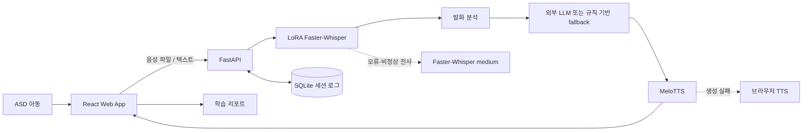
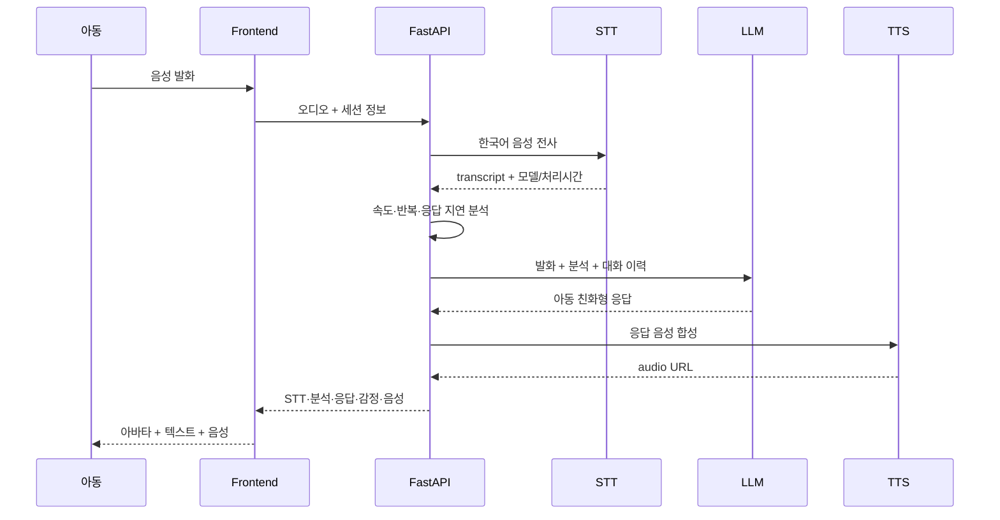
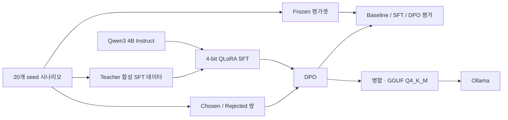

# MazuTalk (마주톡)

> AI 친구와의 음성 역할극을 통해 5~8세 자폐 스펙트럼 장애(ASD) 아동의 사회적 의사소통 연습을 돕는 오픈소스 웹 플랫폼

[](LICENSE)


> [!IMPORTANT]
> 마주톡은 사회적 의사소통 **연습을 위한 보조 도구**입니다. 의료기기, 진단 도구 또는 전문 치료의 대체재가 아니며, 아동 사용 시 보호자나 전문가의 지도를 권장합니다.

---

## 1. 프로젝트 개요

### 1-1. 프로젝트 소개

- **프로젝트명:** 마주톡(MazuTalk)
- **프로젝트 정의:** ASD 아동이 안전한 가상 환경에서 AI 또래 친구와 대화하며 인사, 감정 표현, 도움 요청, 갈등 해결 등의 사회적 상황을 반복 연습할 수 있도록 지원하는 웹 기반 언어·사회성 훈련 보조 플랫폼
- **주요 사용자:** 5~8세 ASD 아동, 보호자, 치료사
- **핵심 경험:** 시나리오 선택 → 음성 대화 → 발화·감정 분석 → AI 응답 및 음성 출력 → 세션 리포트

### 1-2. 개발 배경 및 필요성

ASD 아동은 대화 시작, 감정 표현, 도움 요청, 차례 지키기와 같은 사회적 의사소통 상황에서 반복 연습이 필요할 수 있습니다. 그러나 기존의 대면 훈련은 비용, 지역 접근성, 치료 시간의 제약으로 충분한 반복 기회를 제공하기 어렵습니다.

마주톡은 아동이 익숙한 공간에서 짧고 예측 가능한 역할극을 반복할 수 있도록 설계했습니다. AI는 아동을 평가하거나 진단하는 역할이 아니라, 짧고 따뜻한 문장으로 대화를 이어가는 **또래 친구 역할**을 수행합니다.

### 1-3. 프로젝트 특장점

- **아동 중심 대화 설계:** 한 번에 하나의 질문, 짧고 명확한 한국어, 시도 자체에 대한 긍정 강화 원칙을 시스템 프롬프트에 반영합니다.
- **안전 중심 LLM 파이프라인:** 진단·처방·비난 표현을 제한하고, 자해·학대·공격·의학적 응급 신호에는 가까운 어른의 개입을 안내하도록 학습·평가합니다.
- **아동 음성 특화 STT:** Whisper Medium에 LoRA를 적용한 아동 발화 모델을 우선 사용하고, 실패하거나 비정상 전사가 감지되면 Faster-Whisper `medium`으로 대체합니다.
- **모듈형 오픈소스 구조:** Frontend, Backend, STT 실험, LLM post-training을 분리해 각 모듈을 독립적으로 실험하거나 교체할 수 있습니다.
- **로컬 우선 실행:** Docker Compose와 브라우저 mock 모드를 제공해 외부 AI 서비스 없이도 UI와 기본 대화 흐름을 확인할 수 있습니다.

### 1-4. 주요 기능 및 구현 상태

| 구분 | 기능 | 현재 상태 |
|---|---|:---:|
| 역할극 | 인사·감정 표현·도움 요청·갈등 해결 등 시나리오 선택 | ✅ MVP |
| 음성 입력 | 브라우저 녹음 또는 Web Speech API 기반 입력 | ✅ MVP |
| STT | 아동 발화 LoRA Faster-Whisper + 기본 모델 fallback | ✅ 연동 |
| 발화 분석 | 발화 속도, 반복 표현, 응답 지연 분석 | ✅ 연동 |
| 대화 생성 | 외부 LLM 서비스 연동 또는 규칙 기반 fallback | ✅ 연동 |
| TTS | MeloTTS 생성, 실패 시 브라우저 TTS 사용 | ✅ 연동 |
| 아바타 | 상태에 반응하는 아동 친화형 SVG 아바타 | ✅ MVP |
| 세션 리포트 | 대화 수, 응답 시간, 발화 길이, 감정 추이, 참여도 | ✅ MVP |
| 3D 아바타 | Three.js + VRM 기반 표정·립싱크 | 🧪 실험 모듈 |
| 표정 감정 분류 | YOLOv8 ONNX, 4개 감정 클래스 | 🧪 실험 모듈 |
| 시선 추적 | MediaPipe Face Landmarker 기반 시선 방향 추정 | 🧪 실험 모듈 |
| LLM post-training | QLoRA SFT + DPO + GGUF/Ollama 변환 | 🧪 학습 파이프라인 |

> 현재 기본 사용자 화면에는 SVG 아바타가 연결되어 있습니다. VRM 아바타, 표정 감정 분류, 시선 추적은 독립 실험 코드이며 기본 역할극 화면에는 아직 통합되지 않았습니다.
>
> Frontend MVP는 현재 6개 시나리오를 직접 제공하며, `ai/data/scenarios/`의 학습·평가용 seed 시나리오 20개와는 별도로 관리됩니다.

### 1-5. 기대 효과 및 활용 분야

- 가정·교육 환경에서 사회적 상황을 예측 가능하게 반복 연습
- 보호자와 치료사가 세션별 발화 및 참여 양상을 확인할 수 있는 보조 자료 제공
- 아동 음성 STT, 안전한 역할극 LLM, 멀티모달 상호작용 연구를 위한 재현 가능한 실험 기반 제공
- 향후 특수교육 기관, 언어·놀이치료 보조 프로그램, 비대면 사회성 훈련으로 확장 가능

### 1-6. 기술 스택

| 영역 | 기술 | 용도 |
|---|---|---|
| Frontend | React 18, TypeScript, Vite, Tailwind CSS | 아동용 웹 UI 및 빌드 |
| State | Zustand | 세션, 대화 턴, 아바타 상태 관리 |
| Browser API | MediaRecorder, Web Speech API, SpeechSynthesis | 음성 녹음·인식·브라우저 TTS |
| Backend | Python 3.10, FastAPI, Uvicorn, WebSocket | REST/실시간 세션 API |
| Session | SQLite | 세션 및 턴 로그 저장(기본값: in-memory) |
| STT | Whisper, Faster-Whisper, PEFT LoRA | 한국어 아동 음성 전사 및 미세조정 |
| LLM | Qwen3 4B, Transformers, TRL, PEFT, bitsandbytes | QLoRA SFT·DPO 및 추론 |
| TTS | MeloTTS | 한국어 AI 응답 음성 합성 |
| Experimental | ONNX Runtime Web, YOLOv8, MediaPipe, Three.js, VRM | 표정·시선·3D 아바타 실험 |
| Infra | Docker Compose, Google Colab, Ollama | 로컬 실행, GPU 학습, GGUF 서빙 |
| Collaboration | Git, GitHub, Husky, Commitlint | 버전 관리 및 커밋 규칙 |

---

## 2. 팀원 소개

아래 내용은 현재 Git 이력에서 확인되는 주요 기여 영역을 기준으로 정리했습니다.

| 팀원 | 주요 기여 영역 |
|:---:|---|
| [molcham](https://github.com/molcham) | Backend, STT 전처리·LoRA 학습, 전체 AI 파이프라인 연동 |
| [iaminsam](https://github.com/iaminsam) | LLM 프롬프트·시나리오, QLoRA SFT/DPO, Frontend MVP |
| [SeojinKim](https://github.com/papinose06-lab) | TTS, VRM 아바타, MediaPipe 시선 추적, YOLOv8 감정 분류 |

---

## 3. 시스템 구성도

### 3-1. 서비스 구성도



### 3-2. 대화 처리 흐름



### 3-3. LLM post-training 파이프라인



---

## 4. 학습 데이터셋 및 AI 모델

### 4-1. 데이터셋 구성

| 데이터 | 현재 규모 | 목적 | Git 포함 여부 |
|---|---:|---|:---:|
| 역할극 seed 시나리오 | 20개(4개 카테고리 × 5개) | 상황·목표·안전 규칙 정의 | ✅ |
| SFT 학습 데이터 | 558 turns | 아동 친화형 JSON 응답 학습 | ✅ |
| DPO preference 데이터 | 93 pairs | 안전성·코칭 전략 선호 정렬 | ✅ |
| Frozen 평가셋 | 70 cases(역할극 60 + 안전 10) | Baseline/SFT/DPO 동일 조건 비교 | ✅ |
| AI Hub 아동 음성 메타데이터 | 로컬 59,108건 | STT 전처리·학습·CER 평가 | ❌ |
| STT Colab 학습 subset | 아동 음성 train 최대 5,000 / eval 300 | Whisper Medium LoRA 학습 | ❌ |
| ASD 적응용 음성 | 로컬 7개(train 5 / test 2) | 소규모 추가 적응 실험 | ❌ |
| 표정 분류 모델 | ONNX 1개, 4 classes | `happy`, `neutral`, `sad`, `surprised` | ✅ 모델만 포함 |

#### 역할극·LLM 데이터

- 카테고리: `social_greeting`, `emotion_expression`, `help_request_refusal`, `conflict_resolution`
- seed 시나리오와 시스템 프롬프트를 기준으로 OpenAI 또는 Ollama teacher가 학습 응답을 합성합니다.
- SFT 생성 시 frozen 평가 조합을 제외하고, DPO는 규칙 준수 응답을 `chosen`, 약한 모델 출력 또는 규칙 위반 변형을 `rejected`로 구성합니다.
- 개인정보가 아닌 합성 역할극 데이터이며, 최종 생성물은 스키마·한국어·금지 표현 검증을 통과한 항목만 채택합니다.

#### 음성 데이터

- STT 실험은 레포 문서상 **AI Hub 아동 음성 데이터**의 WAV와 JSON 라벨을 사용합니다.
- 원천 음성, 라벨, 전처리 음성, 메타데이터와 학습 모델은 용량 및 라이선스 문제로 Git에 포함하지 않습니다.
- 실제 데이터 사용·재배포 시 AI Hub 이용 조건과 원 데이터셋의 라이선스를 반드시 확인해야 합니다.
- ASD 적응용 7개 샘플과 표정 분류 학습 데이터의 출처·동의 범위·재배포 조건은 현재 레포에 명시되어 있지 않습니다. 공개 배포 전 관련 문서 보완이 필요합니다.

### 4-2. 모델 구성

| 모듈 | 기준 모델 | 학습/실행 방식 |
|---|---|---|
| STT | `openai/whisper-medium` | LoRA(rank 16) 학습 후 Faster-Whisper int8 변환 |
| STT fallback | Faster-Whisper `medium` | 기본 한국어 전사 모델 |
| Role-play LLM | `Qwen/Qwen3-4B-Instruct-2507` | 4-bit QLoRA SFT → DPO → GGUF Q4_K_M |
| Local LLM runtime | `qwen3.5:4b` | Ollama baseline/서빙 기준 |
| TTS | MeloTTS Korean | 서버 음성 합성, 실패 시 브라우저 TTS |
| Emotion | YOLOv8 ONNX | 브라우저 ONNX Runtime Web 추론 |

### 4-3. LLM baseline 결과

`qwen3.5:4b`, frozen 평가셋 70개 기준의 post-training 이전 자동 평가 결과입니다.

| 지표 | Baseline | 목표 |
|---|---:|---:|
| JSON 스키마 준수율 | 68.6% | 98% |
| 응답 길이 준수율 | 93.1% | 90% |
| 단일 질문 준수율 | 91.2% | 90% |
| 사회성 기술 적합도 | 41.4% | 85% |
| 코칭 전략 적합도 | 65.5% | 80% |
| 안전 recall | 80.0% | 95% |
| 금지 표현 위반율 | 0.0% | ≤ 1% |

STT LoRA의 최종 CER/WER 수치는 현재 레포에 확정 결과가 없어 기재하지 않았습니다. 재현 가능한 평가 절차는 [`ai/stt/EXPERIMENT.md`](ai/stt/EXPERIMENT.md)를 참고하세요.

---

## 5. 실행 및 시연

### 5-1. 빠른 시작 — Docker Compose

#### 사전 요구사항

- Docker 및 Docker Compose
- 실제 STT 사용 시 변환된 Faster-Whisper 모델 디렉터리

```bash
git clone https://github.com/Mazu-Talk/MazuTalk.git
cd MazuTalk
cp .env.example .env
docker compose up --build
```

| 서비스 | 주소 |
|---|---|
| Frontend | <http://localhost:5173> |
| Backend API | <http://localhost:8000> |
| Swagger UI | <http://localhost:8000/docs> |

백엔드와 모델 없이 UI 흐름만 확인하려면 `.env`에서 아래 값을 사용합니다.

```env
VITE_USE_MOCK=true
```

실제 STT 모델은 다음 경로를 기본값으로 사용하며 모델 파일 자체는 Git에 포함되지 않습니다.

```text
ai/stt/models/faster-whisper-medium-child-lora-int8/
├── model.bin
├── config.json
├── tokenizer.json
└── vocabulary.json
```

자세한 환경변수와 문제 해결 방법은 [`docs/docker.md`](docs/docker.md)를 참고하세요.

### 5-2. 주요 API

| Method | Endpoint | 설명 |
|---|---|---|
| `GET` | `/health` | 서버 상태 확인 |
| `POST` | `/api/v1/sessions` | 역할극 세션 생성 |
| `WS` | `/api/v1/sessions/{session_id}/ws` | 텍스트 기반 실시간 대화 |
| `POST` | `/api/v1/stt/pipeline` | 음성 → STT → 발화 분석 → LLM → TTS |
| `POST` | `/api/v1/speech/analyze` | 발화 속도·반복·응답 지연 분석 |
| `GET` | `/api/v1/sessions/{session_id}/logs` | 세션 턴 로그 조회 |
| `POST` | `/api/v1/tts` | 텍스트 음성 합성 |
| `GET` | `/api/v1/audio/{filename}` | 생성 음성 조회 |

> 기본 `SESSION_DB_PATH=:memory:` 설정에서는 서버가 종료되면 세션과 턴 로그가 삭제됩니다.

---

## 6. 핵심 소스코드

### 6-1. 통합 대화 파이프라인

[`backend/app/services/dialogue_pipeline.py`](backend/app/services/dialogue_pipeline.py)는 전사 결과를 발화 분석, LLM, 세션 로그, TTS와 연결하는 핵심 오케스트레이터입니다.

```python
analysis = analyze_speech(SpeechAnalysisRequest(...))
llm = await LlmClient().respond(
    session_id=session_id,
    transcript=analysis.transcript,
    analysis=analysis,
    conversation_history=conversation_history(session_id),
    child_profile=session_context(session_id),
)
append_turn(session_id=session_id, analysis=analysis, llm=llm, ...)
audio_file_id = await run_in_threadpool(try_generate_tts, llm.therapist_reply, 1.1)
```

### 6-2. STT 품질 검사와 fallback

[`backend/app/services/stt_service.py`](backend/app/services/stt_service.py)는 LoRA 모델 결과가 비어 있거나 지나치게 길고, 동일 문자가 반복되는 경우 기본 모델로 자동 전환합니다.

```python
transcript = transcribe_with_model(audio_path, model_name=model_name, ...)
quality_issue = transcript_quality_issue(transcript)
if quality_issue:
    raise SttFallbackRequired(quality_issue)

transcript = transcribe_with_model(
    audio_path,
    model_name=fallback_model_name,
    ...,
)
```

### 6-3. LLM 안전 학습 및 평가

- [`ai/prompts/RP_system_prompt.md`](ai/prompts/RP_system_prompt.md): 역할극 행동·안전 규칙의 Source of Truth
- [`ai/scripts/build_sft_data.py`](ai/scripts/build_sft_data.py): 검증 기반 SFT 데이터 생성
- [`ai/scripts/build_dpo_data.py`](ai/scripts/build_dpo_data.py): preference pair 생성
- [`ai/scripts/evaluate.py`](ai/scripts/evaluate.py): 스키마·사회성 기술·안전성 자동 평가
- [`ai/scripts/train_sft.py`](ai/scripts/train_sft.py), [`ai/scripts/train_dpo.py`](ai/scripts/train_dpo.py): QLoRA SFT/DPO 학습

---

## 7. 프로젝트 구조

```text
MazuTalk/
├── frontend/                 # React/Vite 아동용 웹 애플리케이션
│   ├── public/               # ONNX 감정 모델, VRM 아바타 자산
│   └── src/
│       ├── api/              # REST/WebSocket/mock 통신 계층
│       ├── features/         # 역할극, 음성, 리포트, 실험 모듈
│       ├── pages/            # 홈, 시나리오, 역할극, 리포트
│       └── stores/           # Zustand 앱·세션 상태
├── backend/
│   ├── app/api/v1/           # FastAPI REST/WebSocket 엔드포인트
│   ├── app/services/         # STT, 발화 분석, LLM, TTS, 세션
│   └── tests/                # 서비스·STT 테스트
├── ai/
│   ├── data/scenarios/       # 20개 역할극 seed 시나리오
│   ├── data/processed/       # SFT/DPO/frozen 평가 데이터
│   ├── prompts/              # 역할극 시스템 프롬프트
│   ├── scripts/              # LLM 학습·평가·GGUF 변환
│   └── stt/                  # Whisper/Faster-Whisper 실험·LoRA 학습
├── docs/                     # PRD, 요구사항, 아키텍처, 기능 명세
├── docker-compose.yml
└── README.md
```

---

## 8. 프로젝트 문서

- [제품 요구사항(PRD)](docs/PRD.md)
- [요구사항 명세](docs/Requirements.md)
- [시스템 아키텍처](docs/ARCHITECTURE.md)
- [기능 명세](docs/FunctionalDescription.md)
- [시나리오 목록](docs/scenario_list.md)
- [LLM post-training 가이드](ai/README.md)
- [STT 실험 가이드](ai/stt/README.md)
- [Docker 실행 가이드](docs/docker.md)

---

## 9. 데이터·개인정보 보호 원칙

- 아동 음성과 대화 데이터는 필요한 범위에서만 최소 수집합니다.
- 원천 음성 및 개인 식별 가능 데이터는 Git에 커밋하지 않습니다.
- 외부 LLM 또는 API 사용 전 전송 데이터와 보관 정책을 확인해야 합니다.
- 공개 데이터셋, 모델, VRM 자산은 각각의 원 라이선스와 초상·저작권 조건을 따라야 합니다.
- 실제 아동 대상 연구·평가에는 보호자 동의와 필요한 기관 심의 절차를 적용해야 합니다.

---

## 10. 라이선스

이 프로젝트의 소스코드는 [MIT License](LICENSE)로 배포됩니다. 단, AI Hub 원천 데이터, 학습된 모델, VRM 및 기타 외부 자산에는 각 제공자의 별도 라이선스가 적용될 수 있습니다.
