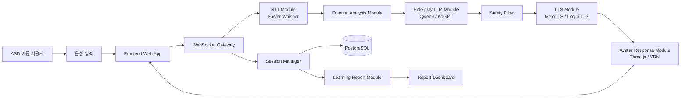
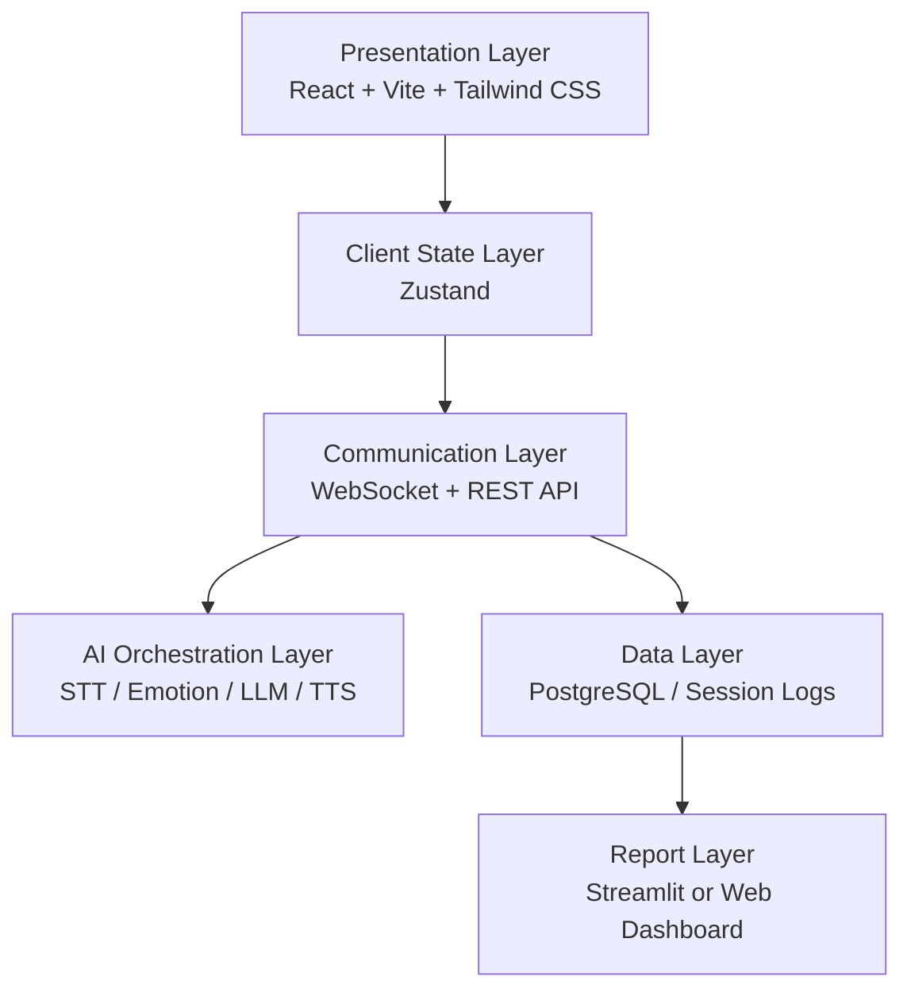
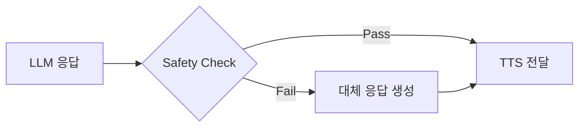
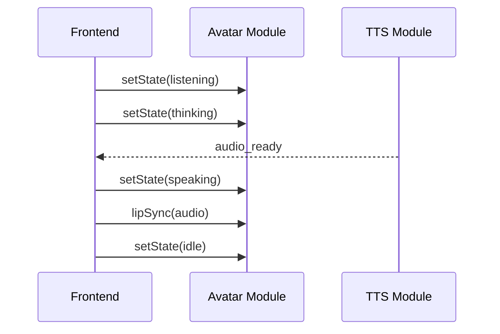
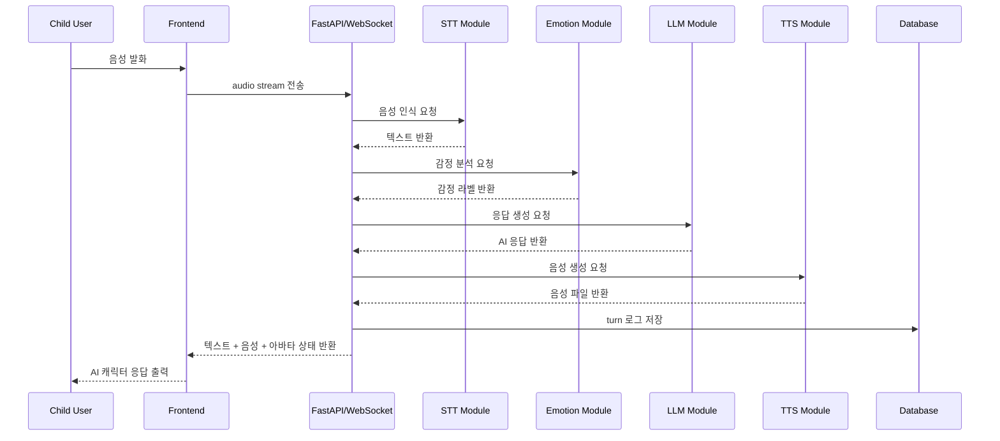
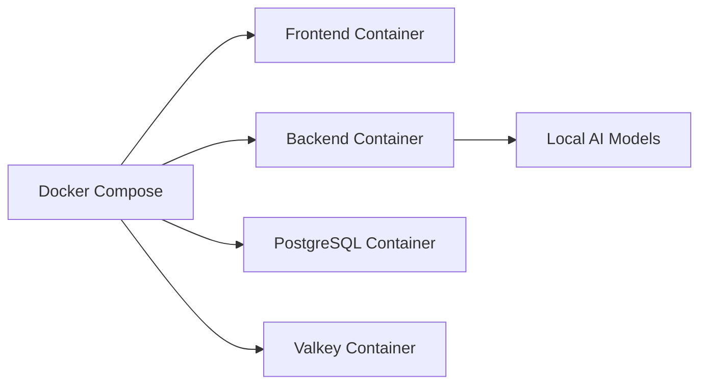

# ARCHITECTURE.md

# 마주톡(MazuTalk) 시스템 아키텍처 문서

## 1. 문서 개요

본 문서는 **AI 롤플레잉 기반 자폐아동 언어 대화 치료 시뮬레이션 플랫폼, 마주톡(MazuTalk)**의 시스템 아키텍처를 정의한다.

마주톡은 자폐 스펙트럼 장애(ASD) 아동이 가상의 AI 캐릭터와 음성 기반 역할극을 수행하며 사회적 의사소통, 감정 표현, 도움 요청, 갈등 대처를 반복적으로 연습할 수 있도록 지원하는 웹 기반 AI 학습 플랫폼이다.

---

## 2. 아키텍처 목표

본 시스템의 아키텍처 목표는 다음과 같다.

1. 아동의 음성 입력을 실시간으로 처리한다.
2. STT, 감정 분석, LLM, TTS, 아바타 출력을 하나의 대화 파이프라인으로 연결한다.
3. 아동의 발화 특성과 감정 상태를 반영하여 안전한 AI 응답을 생성한다.
4. 세션 단위로 대화 로그와 학습 결과를 저장한다.
5. 보호자 또는 치료사가 학습 결과를 확인할 수 있는 리포트를 제공한다.
6. 오픈소스 기반 기술 스택으로 로컬 실행 및 확장이 가능하도록 구성한다.

---

## 3. 전체 시스템 구조



---

## 4. 레이어 구조



---

## 5. 주요 컴포넌트

## 5.1 Frontend Web App

### 역할

사용자와 직접 상호작용하는 웹 인터페이스를 제공한다.

### 주요 기능

- 시나리오 선택
- 마이크 입력
- 실시간 STT 결과 표시
- AI 응답 표시
- 아바타 상태 표시
- TTS 음성 재생
- 학습 결과 확인

### 기술 스택

| 기술           | 용도                         |
| -------------- | ---------------------------- |
| React          | UI 컴포넌트 구현             |
| Vite           | 프론트엔드 개발 서버 및 빌드 |
| Tailwind CSS   | 아동 친화형 UI 스타일링      |
| Zustand        | 세션 상태 관리               |
| Three.js / VRM | 3D 아바타 렌더링             |

---

## 5.2 WebSocket Gateway

### 역할

실시간 대화 세션의 입출력을 관리한다.

### 주요 기능

- session_id 생성
- turn_id 관리
- 음성 입력 이벤트 수신
- STT 결과 전달
- LLM 응답 전달
- TTS 상태 전달
- 아바타 상태 이벤트 전달

### 통신 방식

- 실시간 대화: WebSocket
- 리포트 조회: REST API
- 시나리오 조회: REST API

---

## 5.3 STT Module

### 역할

아동의 음성 발화를 텍스트로 변환한다.

### 기술 후보

- Faster-Whisper

### 입력

```json
{
  "session_id": "session_001",
  "turn_id": 1,
  "audio": "binary_audio_stream"
}
```

### 출력

```json
{
  "session_id": "session_001",
  "turn_id": 1,
  "text": "안녕, 같이 놀자",
  "confidence": 0.87
}
```

### 추가 분석 항목

- 발화 길이
- 응답 지연 시간
- 반복 표현
- 비언어적 발화 여부
- 발화 중단 여부

---

## 5.4 Emotion Analysis Module

### 역할

STT 결과와 대화 맥락을 기반으로 아동의 감정 상태를 추정한다.

### 감정 라벨

| 라벨     | 의미   |
| -------- | ------ |
| happy    | 기쁨   |
| anxious  | 긴장   |
| confused | 혼란   |
| passive  | 소극적 |
| neutral  | 중립   |

### 입력

```json
{
  "text": "잘 모르겠어...",
  "response_time_ms": 4200,
  "utterance_length": 7
}
```

### 출력

```json
{
  "emotion": "confused",
  "confidence": 0.76,
  "signals": {
    "short_utterance": true,
    "delayed_response": true
  }
}
```

---

## 5.5 Role-play LLM Module

### 역할

현재 시나리오, 대화 이력, 감정 상태를 기반으로 AI 캐릭터의 응답을 생성한다.

### 기술 후보

- Qwen3
- KoGPT

### 입력

```json
{
  "session_id": "session_001",
  "scenario_id": "playground_greeting",
  "character_role": "peer_friend",
  "child_text": "안녕",
  "emotion": "happy",
  "difficulty": "easy",
  "history": [
    {
      "speaker": "ai",
      "text": "안녕! 나는 미래야. 같이 놀래?"
    },
    {
      "speaker": "child",
      "text": "안녕"
    }
  ]
}
```

### 출력

```json
{
  "response_text": "안녕! 만나서 반가워. 오늘은 뭐 하고 놀고 싶어?",
  "intent": "continue_conversation",
  "next_prompt_type": "open_question"
}
```

### 프롬프트 설계 원칙

1. 짧고 명확한 문장을 사용한다.
2. 아동에게 과도한 선택지를 제공하지 않는다.
3. 비난, 평가, 압박 표현을 사용하지 않는다.
4. 부정확한 의료적 판단을 하지 않는다.
5. 위험하거나 공포감을 줄 수 있는 표현을 피한다.
6. 아동의 감정 상태에 맞춰 난이도를 조절한다.

---

## 5.6 Safety Filter

### 역할

LLM 응답이 아동에게 부적절하지 않은지 검증한다.

### 차단 항목

- 폭력적 표현
- 욕설
- 차별 표현
- 공포 유발 표현
- 의료 진단
- 자해 유도
- 보호자 없이 수행하기 어려운 위험 행동
- 지나치게 복잡한 문장

### 처리 방식



### 대체 응답 예시

```json
{
  "response_text": "괜찮아. 천천히 말해도 돼. 다시 한 번 같이 해볼까?"
}
```

---

## 5.7 TTS Module

### 역할

AI 응답 텍스트를 자연스러운 음성으로 변환한다.

### 기술 후보

- MeloTTS
- Coqui TTS

### 입력

```json
{
  "text": "안녕! 만나서 반가워.",
  "voice_style": "child_friendly",
  "emotion": "happy",
  "speed": 0.9
}
```

### 출력

```json
{
  "audio_url": "/audio/session_001_turn_002.wav",
  "duration_ms": 2400
}
```

---

## 5.8 Avatar Response Module

### 역할

AI 캐릭터의 시각적 반응을 제공한다.

### 기술 스택

- Three.js
- VRM
- Web Audio API

### 아바타 상태

| 상태        | 설명             |
| ----------- | ---------------- |
| idle        | 대기             |
| listening   | 사용자 음성 청취 |
| thinking    | AI 응답 생성 중  |
| speaking    | TTS 재생 중      |
| happy       | 긍정 감정 표현   |
| confused    | 혼란 감정 표현   |
| encouraging | 격려 표현        |

### 이벤트 흐름



---

## 5.9 Learning Report Module

### 역할

세션 종료 후 아동의 대화 수행 결과를 요약한다.

### 리포트 항목

- 총 대화 횟수
- 평균 응답 시간
- 평균 발화 길이
- 감정 변화
- 시나리오 완료 여부
- 대화 지속성
- 참여도 점수

### 출력 예시

```json
{
  "session_id": "session_001",
  "scenario_id": "playground_greeting",
  "total_turns": 12,
  "avg_response_time_ms": 3100,
  "dominant_emotion": "happy",
  "participation_score": 82,
  "completion_status": "completed"
}
```

---

## 6. 데이터 흐름

## 6.1 실시간 대화 처리 흐름



---

## 7. 데이터 모델

## 7.1 Session

```json
{
  "session_id": "string",
  "child_id": "string",
  "scenario_id": "string",
  "started_at": "datetime",
  "ended_at": "datetime",
  "status": "active | completed | interrupted"
}
```

---

## 7.2 ConversationTurn

```json
{
  "turn_id": "string",
  "session_id": "string",
  "speaker": "child | ai",
  "text": "string",
  "emotion": "happy | anxious | confused | passive | neutral",
  "response_time_ms": "number",
  "created_at": "datetime"
}
```

---

## 7.3 Scenario

```json
{
  "scenario_id": "string",
  "title": "친구에게 인사하기",
  "location": "playground",
  "target_skill": "greeting",
  "difficulty": "easy",
  "ai_role": "peer_friend",
  "opening_message": "안녕! 같이 놀래?",
  "success_criteria": [
    "인사 표현을 말한다",
    "상대방의 질문에 응답한다",
    "대화를 3턴 이상 유지한다"
  ]
}
```

---

## 7.4 Report

```json
{
  "report_id": "string",
  "session_id": "string",
  "total_turns": "number",
  "avg_response_time_ms": "number",
  "avg_utterance_length": "number",
  "emotion_timeline": [
    {
      "turn_id": 1,
      "emotion": "anxious"
    }
  ],
  "participation_score": "number",
  "created_at": "datetime"
}
```

---

## 8. API 설계

## 8.1 REST API

| Method | Endpoint                       | 설명               |
| ------ | ------------------------------ | ------------------ |
| GET    | /api/scenarios                 | 시나리오 목록 조회 |
| GET    | /api/scenarios/{scenario_id}   | 시나리오 상세 조회 |
| POST   | /api/sessions                  | 새 학습 세션 생성  |
| GET    | /api/sessions/{session_id}     | 세션 정보 조회     |
| POST   | /api/sessions/{session_id}/end | 세션 종료          |
| GET    | /api/reports/{session_id}      | 학습 리포트 조회   |

---

## 8.2 WebSocket API

### Endpoint

```text
/ws/sessions/{session_id}
```

### Client → Server 이벤트

```json
{
  "type": "audio_chunk",
  "session_id": "session_001",
  "turn_id": 1,
  "payload": {
    "audio": "binary"
  }
}
```

```json
{
  "type": "end_utterance",
  "session_id": "session_001",
  "turn_id": 1
}
```

### Server → Client 이벤트

```json
{
  "type": "stt_result",
  "payload": {
    "text": "안녕"
  }
}
```

```json
{
  "type": "ai_response",
  "payload": {
    "text": "안녕! 만나서 반가워.",
    "emotion": "happy",
    "audio_url": "/audio/session_001_turn_002.wav",
    "avatar_state": "speaking"
  }
}
```

---

## 9. 디렉터리 구조

```text
mazutalk/
├── frontend/
│   ├── src/
│   │   ├── components/
│   │   │   ├── Avatar/
│   │   │   ├── ScenarioCard/
│   │   │   ├── MicButton/
│   │   │   └── Report/
│   │   ├── pages/
│   │   │   ├── ScenarioSelectPage.tsx
│   │   │   ├── RolePlayPage.tsx
│   │   │   └── ReportPage.tsx
│   │   ├── stores/
│   │   │   └── sessionStore.ts
│   │   ├── api/
│   │   │   ├── websocket.ts
│   │   │   └── client.ts
│   │   └── main.tsx
│   └── package.json
│
├── backend/
│   ├── app/
│   │   ├── main.py
│   │   ├── api/
│   │   │   ├── scenarios.py
│   │   │   ├── sessions.py
│   │   │   └── reports.py
│   │   ├── websocket/
│   │   │   └── session_ws.py
│   │   ├── services/
│   │   │   ├── stt_service.py
│   │   │   ├── emotion_service.py
│   │   │   ├── llm_service.py
│   │   │   ├── tts_service.py
│   │   │   └── report_service.py
│   │   ├── models/
│   │   │   ├── session.py
│   │   │   ├── scenario.py
│   │   │   └── report.py
│   │   └── schemas/
│   │       ├── session_schema.py
│   │       ├── chat_schema.py
│   │       └── report_schema.py
│   └── requirements.txt
│
├── data/
│   ├── scenarios/
│   │   └── scenario_samples.json
│   ├── prompts/
│   │   └── roleplay_prompt.md
│   └── reports/
│
├── docs/
│   ├── PRD.md
│   ├── Requirements.md
│   ├── FunctionalDescription.md
│   └── ARCHITECTURE.md
│
├── docker-compose.yml
├── README.md
└── LICENSE
```

---

## 10. 배포 및 실행 구조

## 10.1 로컬 실행



---

## 10.2 Docker Compose 구성 요소

| 서비스        | 역할                      |
| ------------- | ------------------------- |
| frontend      | React 웹 앱               |
| backend       | FastAPI 서버              |
| postgres      | 세션 및 리포트 저장       |
| valkey        | 비동기 작업 캐시          |
| model-runtime | STT / LLM / TTS 실행 환경 |

---

## 11. 보안 및 개인정보 보호

본 시스템은 아동 음성 및 대화 데이터를 처리하므로 다음 원칙을 따른다.

1. 음성 원본은 기본적으로 장기 저장하지 않는다.
2. 세션 로그는 익명화된 child_id 기준으로 저장한다.
3. 외부 API 사용 시 음성 및 민감 데이터 전송 여부를 명확히 고지한다.
4. 보호자 또는 치료사 외에는 리포트에 접근할 수 없도록 한다.
5. 데이터셋 출처와 라이선스를 README에 명시한다.
6. 의료 진단 또는 치료 효과를 단정하지 않는다.

---

## 12. 장애 처리 전략

| 장애 상황          | 처리 방식                   |
| ------------------ | --------------------------- |
| STT 실패           | "다시 한 번 말해줄래?" 안내 |
| LLM 응답 지연      | 기본 격려 문장 반환         |
| TTS 실패           | 텍스트 응답만 표시          |
| WebSocket 끊김     | 세션 재연결 시도            |
| DB 저장 실패       | 로컬 임시 로그 저장         |
| Safety Filter 실패 | 안전한 대체 응답 사용       |

---

## 13. 성능 목표

| 항목               | 목표      |
| ------------------ | --------- |
| STT 처리 시간      | 2초 이내  |
| LLM 응답 생성 시간 | 3초 이내  |
| TTS 생성 시간      | 2초 이내  |
| 전체 턴 응답 시간  | 7초 이내  |
| 세션 유지 시간     | 최소 5분  |
| 평균 대화 턴 수    | 10턴 이상 |

---

## 14. 확장 가능성

향후 확장 가능한 기능은 다음과 같다.

1. ASD 심각도 기반 난이도 자동 조절
2. 보호자 계정 및 아동 프로필 관리
3. 치료사 피드백 입력 기능
4. 시선 추적 및 표정 분석 고도화
5. 시나리오 추천 시스템
6. 장기 학습 변화 추적
7. 다중 캐릭터 Role-play
8. 모바일 앱 확장

---

## 15. 기술적 리스크 및 대응

| 리스크             | 설명                                  | 대응                               |
| ------------------ | ------------------------------------- | ---------------------------------- |
| STT 정확도 저하    | 아동 발화 특성으로 인식률 저하 가능   | Faster-Whisper 실험 및 발화 후처리 |
| LLM 부적절 응답    | 아동에게 적합하지 않은 문장 생성 가능 | Safety Filter 적용                 |
| 응답 지연          | STT-LLM-TTS 파이프라인으로 지연 발생  | WebSocket 비동기 처리              |
| TTS 품질 부족      | 아동 친화적 음성 품질 검증 필요       | MeloTTS, Coqui TTS 비교            |
| 아바타 구현 난이도 | 3D 렌더링 및 립싱크 구현 부담         | MVP에서는 기본 표정/상태 전환 우선 |
| 개인정보 이슈      | 아동 음성 및 대화 로그 저장 위험      | 최소 수집, 익명화, 로컬 실행 우선  |

---

## 16. MVP 아키텍처 범위

## 포함

- React 기반 웹 UI
- 시나리오 선택
- 음성 입력
- STT
- 감정 분석
- LLM 응답 생성
- Safety Filter
- TTS 출력
- 아바타 상태 전환
- 세션 로그 저장
- 학습 리포트

## 제외

- 실제 의료 진단
- 치료 효과 판정
- 보호자 계정 인증
- 모바일 앱
- 고도화된 표정/시선 분석
- 실시간 다중 사용자 세션

---

## 17. 결론

마주톡의 아키텍처는 STT, 감정 분석, LLM, TTS, 아바타, 리포트 모듈을 WebSocket 기반 실시간 세션으로 연결하는 구조이다.

MVP 단계에서는 복잡한 의료 진단 기능보다, 아동이 안전한 환경에서 반복적으로 사회적 상황을 연습할 수 있는 음성 기반 Role-play 흐름을 안정적으로 구현하는 것을 우선한다.

따라서 본 시스템은 다음 구조를 핵심으로 한다.

```text
음성 입력
→ STT
→ 감정 분석
→ LLM Role-play 응답 생성
→ Safety Filter
→ TTS
→ 아바타 출력
→ 학습 리포트
```
